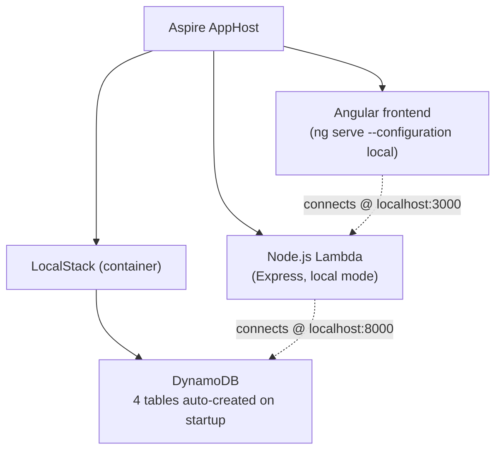

# Local dev environment (Aspire) — FishTracker

What this is: runs the FishTracker API and SPA together against an
emulated AWS backend, so the whole stack works locally without an AWS
account. Orchestrated with .NET Aspire; DynamoDB is emulated by LocalStack.

Built with: .NET Aspire (AppHost + ServiceDefaults), LocalStack.

## Architecture



## Where things are

- `FishTracker.AppHost/Program.cs` — defines the three resources above and
  their startup order (`WaitFor`).
- `FishTracker.ServiceDefaults/` — OpenTelemetry + health-check wiring
  shared by the AppHost-managed services, shown in the Aspire dashboard.
- `localstack/init-dynamodb.sh` — creates the 4 DynamoDB tables when
  LocalStack starts.

## How it works

- LocalStack's container port 4566 is mapped to **host port 8000**,
  matching the hardcoded `http://localhost:8000` endpoint that
  `FishTrackerLambdaNode`'s local DynamoDB client uses — no code changes
  needed to point it at LocalStack instead of real AWS.
- `FishTrackerLambdaNode` runs without `IS_LAMBDA` set, which triggers its
  local Express server and local-mode DynamoDB client (see
  `FishTrackerLambdaNode/SYSDOC.md`).
- `angular` runs with the `local` build configuration, which points API
  calls at `localhost:3000` and bypasses authentication (see
  `angular/SYSDOC.md`).
- LocalStack uses `ContainerLifetime.Persistent`, so data survives AppHost
  restarts.

### DynamoDB tables (LocalStack)

| Table | Partition Key | Sort Key |
|-------|--------------|----------|
| `FishTracker-Trips-Prod` | `Subject` (S) | `TripId` (S) |
| `FishTracker-Catch-Prod` | `TripKey` (S) | `CatchId` (S) |
| `FishTracker-Profile-Prod` | `Subject` (S) | — |
| `FishTracker-Settings-Prod` | `Settings` (S) | — |

## Running / using this area

Setup and `dotnet run` usage are in `README.md`. To interact with the
emulated DynamoDB directly:

```bash
# List tables
aws --endpoint-url=http://localhost:8000 dynamodb list-tables --region eu-central-1

# Scan a table
aws --endpoint-url=http://localhost:8000 dynamodb scan \
    --table-name FishTracker-Trips-Prod --region eu-central-1
```
